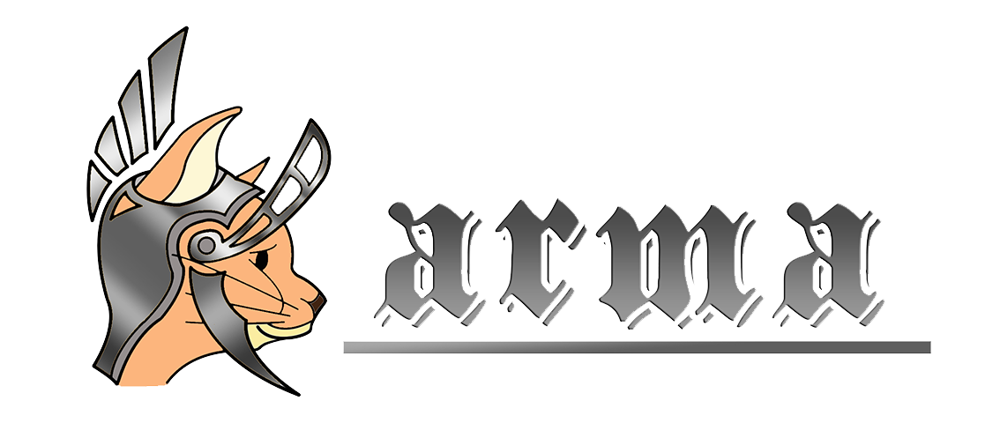

# Karma
> A distributed/decentralized framework for interactable data.

Karma is a distributed/decentralized, secure, multi-layered data interaction framework designed for IoT designs and even more advanced devices. Karma's goal is to provide a data interaction framework that is different from traditional centralized design in an attempt to address traditional centralized data sensing, single point of failure in interactive scenarios, data security, and network stability.

Karma是一个分布式/去中心化，安全，多层次，为物联网设计乃至更高级设备设计的数据交互框架。Karma目标是提供一个不同于传统中心化设计的数据交互框架，以试图解决传统中心化数据传感，交互方案中单点失效，数据安全，网络稳定性等方面的问题。

---

文档维护：
- [tiannian](https://github.com/tiannian) <dtiannian@aliyun.com, dtiannian@gmail.com>

## 语言
- [中文](zh/README.md) 
- [English](en/Readme.md)

