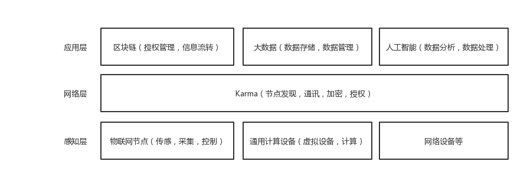

# 设计思路

物联网发展到现在，在各种不同的应用场景下都有其重要的应用。在不同的场景下，对网络有各种不同的要求，由此产生了不同的网络设计。我们设计的Karma试图应用在一个对网络数据实时性要求不是那么高，而同时又对网络安全性，稳定性有一定要求的场景下。我们希望尽量降低节点的维护代价与制造成本。

## 项目层次
根据现有的物联网技术方案，我们大致可以将物联网的结构分为三层，分别为：感知层，网络层，应用层。

感知层构成主体为各类传感器与执行器，包括标签读写器，摄像头，GPS等，主要负责收集物理世界中的信息以及根据上层指令执行指定的操作。

网络层主要负责传输感知层的数据与指令，负责节点的网络接入，组网传输等。

应用层利用云计算，大数据以及人工智能等技术处理经由网络层传输至应用层的数据，并发出传感层所执行的指令。

Karma作为物联网网络框架，主要工作于物联网网络层。对上层连接区块链（权限，授权），大数据中心（存储，运算）或人工智能（数据分析，处理）技术；对下则连接来自不同厂商的设备（物理设备，虚拟设备）。

## 项目设计

### 瘦节点设计

在物联网网络设计中，节点应主要关注与传感与控制，而非进行大量计算。在我们的设计思路中每一个节点不再是孤立的存在，甚至节点可以永远不与用户产生交互，节点的功能主要关注于基础功能实现，传感与控制功能。而用户的指令将通过网络传递给节点。而节点传感得到的数据将被传递至高性能设备，数据中心（个人/公共）或云（公有私有）计算平台进行处理。通过这样的设计，可以降低对节点的性能要求，令物联网设备的设计更加专注于具体的功能。

### 去中心化设计

现行物联网方案中，厂商(或物联网接入服务商)往往会部署一个中央服务器或者数据中心用于直接连接节点。而在我们的设计中将组网与节点控制交由去中心化算法协议进行节点发现与节点控制，而数据中心仅仅在有节点拥有者授权的情况下读取节点数据并进行分析。解决中心化物联网解决方案中可能会带来的隐私，数据安全等问题。同时利用去中心化设计，避免了网络单点失效引发的问题，减少维护成本。

### 复合网络设计

Karma将会支持多种网络连接方式，节点会在建立网络连接时根据不同的节点所处的网络环境建立不同的连接，可能支持的网络连接方式包括WiFi，6LowPAN，Bluetooth等方式。同时节点会在利用去中心化环境，与物联网设备条件下设计的协议，保证节点可以应对多种复杂网络环境问题，而对于应用层开发者与用户而言，只需要关注于节点ID等抽象概念即可。降低开发成本，以及用户使用时的心智成本。

### 加密与高安全性

Karma采用为物联网设备设计的TLS-like协议[Disco](https://www.davidwong.fr/embeddeddisco/)，利用最新密码学算法保护网络中的数据通讯，在对设备资源低消耗的情况下，提供高安全性的密码学方案。同时，网络会采用全新的节点标识体系，实现了在去中心化网络中无需CA即可实现正常公钥分发的功能，实现去中心化的物联网节点身份认证体系。网络同时也会提供一套权限控制机制，保证网络中的节点数据的安全性。

### 资源抽象与高可移植性

Karam使用了CoAP协议栈作为应用层传输协议，利用CoAP协议内建的资源概念，规范对节点访问的API，同时提供对节点资源进行发现的功能。

由于Karma网络同时为多种类型的节点设备设计，Karma提供了对硬件功能进行抽象的抽象层，同时提供构建工具用于方便的在不同平台，不同架构的节点进行移植与构建。

## 与现有项目的异同

### 与区块链的异同

与Karma类似，区块链也属于一种去中心化系统，但两者所解决的问题是各不相同的。区块链的不可篡改，可回溯，具有共识的特征，适用于包括加密货币，去中心化见证，社区治理等领域。而Karma作为一个去中心化的数据交互框架与网络基础设施，并不具有区块链这样的功能，它工作的层次比区块链更加底层。当然，Karma可以作为区块链的网络底层，为去中心化应用提供网络层的支持。

### 与物联网操作系统的异同

Karma并不是物联网操作系统，原因是因为它仅仅关注于物联网节点在网络层中发生的事情；而物联网操作系统则需要负责对物联网节点本身的资源，包括软件硬件资源进行管理，这样的事情是Karma不会做的。Karma可以与现存的物联网操作系统共存，两者负责不同方面的事情更加合适。

